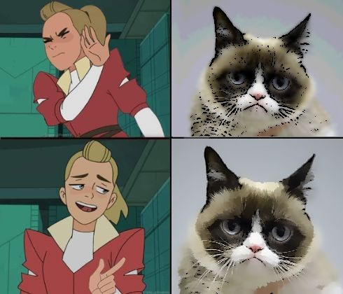
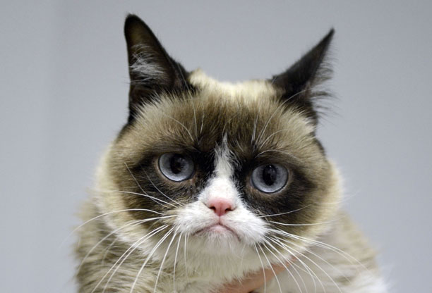
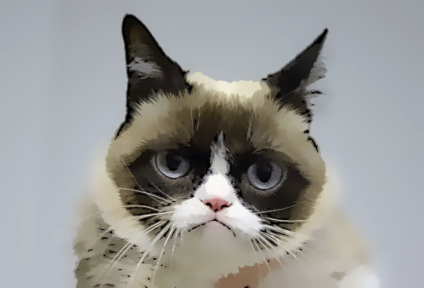
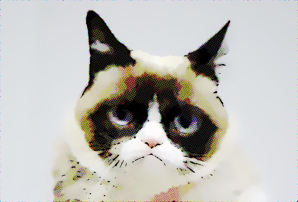

# Faux cartoon effect with OpenCV

Common tutorials around the web suggest that cartoon filters can be easily done by using [median blurring](https://docs.opencv.org/3.4/d4/d86/group__imgproc__filter.html#ga564869aa33e58769b4469101aac458f9),
adaptive thresholding and edge detection. While this works, it achieves sub-par results almost certainly.

This approach replaces median blurring
with [anisotropic diffusion](https://docs.opencv.org/3.4/df/d2d/group__ximgproc.html#gaffedd976e0a8efb5938107acab185ec2)
and uses [edge dilation](https://docs.opencv.org/3.4/d4/d86/group__imgproc__filter.html#ga4ff0f3318642c4f469d0e11f242f3b6c)
for more natural looking "strokes", as well as
[pyramid mean shift filtering](https://docs.opencv.org/3.4/d4/d86/group__imgproc__filter.html#ga9fabdce9543bd602445f5db3827e4cc0)
for color reduction to achieve a more comic-like effect.

    

This, of course, also only works with proper tuning of the parameters.

Here's the input image and the produced result for comparison. An alternative print-like faux-CMYK half-toning step was
added using the [rotated-grid](https://github.com/sunsided/rotated-grid) crate;
to play around with that, simply run the code with `--features=halftone`.

| Input               | Output                       | Halftoned                 |
|---------------------|------------------------------|---------------------------|
|  |  |  |

YMMV. 🐱
